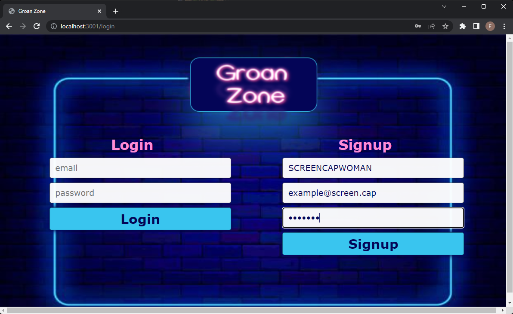

# Groan Zone
The Groan Zone is a website with a simple, blog-like layout. The content is intended to be all "dad jokes". The site is organized by posts, which can each be upvoted or downvoted by visitors.

# Description
When visitors enter the Groan Zone, they are greeted with a splash page, that shows the top five "dad jokes" of the day. From there, they can navigate to the login page, or to a page that lists all jokes, in order of chronological creation.

Visitors can register a user account, or login to a pre-existing account. Registered users can post a joke, which is then subject to upvoting and downvoting.

## Table of Contents

 *  [Installation](#installation)
 *  [Usage](#usage)
 *  [Screenshot](#screenshot)
 *  [Testing](#testing)

## Installation
1. Install Node.js v16.
2. Intsall Mysql 8.0
3. Install inquirer, please use npm i inquirer@8.2.4
4. To connect with database, create file .env to store username, database name and password.
5. Run command npm install.
6. Navigate to db directory and run command "SOURCE schema.sql".
7. Tell MySQL to "USE joke_db;".
8. Navigate to seeds directory and run "node seeds/seed.js".
9. Now restart server by using command "npm start"

## Usage

The repository is available at:

https://github.com/strait2thepoint/DadJokeAPI

## Screenshot

## Testing

1. Stop server by using command "ctrl c"
2. Navigate to db directory and run command "SOURCE schema.sql";
3. Navigate to seeds directory and run "node seeds/seed.js";
4. Now restart server by using command "npm start"

### Test routes (append these after http://loclahost:3001):

/api/login              <-- POST only (log in a user)
/api/logout             <-- POST only (log out a user)

/api/users              <-- GET or POST (see a JSONified list of all users' data)
/api/users/:id          <-- GET         (see an individual user's data JSONified)

/api/jokes              <-- GET or POST    (see JSONified data for all jokes, or POST a new joke in JSON format)
/api/jokes/:id          <-- GET or DELETE  (see JSONified data for an individual joke, or DELETE an individual joke)
/api/jokes/upvote/:id   <-- PUT only       (alter the RATING data of an individual joke by incrementing it)
/api/jokes/downvote/:id <-- PUT only       (alter the RATING data of an individual joke by decrementing it)

## License

GNU General Public License v3.0 

